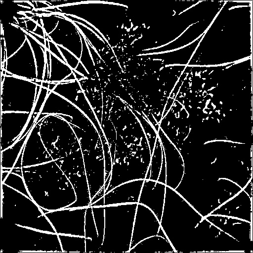
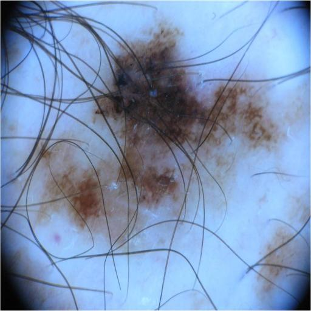
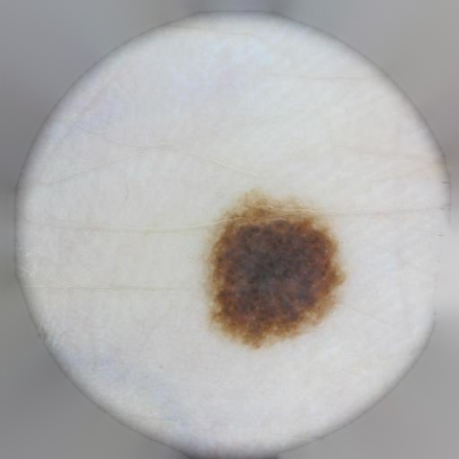

# Skin Cancer Detection Project
* Collaborating with the help of Hershey Medical Center to create a web application for skin cancer detection.
* Using image segmentation and a variety of advanced techniques to develop a highly effective diagnostic tool with superior performance.
* Designing the application with a responsive interface for easy transition to a progressive web app, ensuring cross-platform use and offline access.
* Integrating saliency maps to identify and visualize crucial image areas, making the diagnostic process transparent and understandable for users.
* Various Vision Transformers and CNN-based architectures were tested to compare their performance.

The Web application implementation repository can be found here:  
https://github.com/jinyoonok2/SkinWebApp

# Research Goal
This project has evolved into a separate research paper for further development and publication.

The purpose of the research is to develop an all-in-one framework that integrates various techniques and pipelines with adjusted architectures for accurate skin lesion detection:
* It incorporates multiple algorithms and models capable of detecting confounding factors such as dark corner areas, hairs, and medical marks from skin image data, then removes them to ensure the model's correct interpretation of the information.
* An interpretability framework will be provided to analyze the model's comprehension of the image data and to assess how the removal of confounding factors affects the results.
* The framework enhances the accuracy of the YOLOv8 object detection model by incorporating additional modules, such as BiFCN and an attention module.
* A range of vision models, from the basic YOLOv8 model to vision transformers, are experimented with to compare performance.

# Sample images

